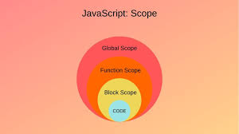
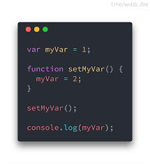
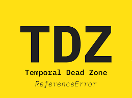

# Что такое Scope в JS

Область видимости (или scope) в JS – это как "зона доступа" 🚧 для переменных и функций. Если переменная объявлена глобально 🌍, её видно везде. Локально 🏠 – только внутри функции.

## Какие есть области видимости в JS?

* Область видимости глобаьный
* Блочная область видимости 
* Область видимости функции 
* Область видимости модуля 

 ## Глобальная и локальная область видимости 

Это два основных типа области видимости в JavaScript. Глобальные переменные объявляются вне всех функций и доступны отовсюду в коде. Это значит, что они могут быть использованы и изменены в любом месте программы. С другой стороны, локальные переменные объявляются внутри функций и доступны только в пределах этих функций. Это помогает избегать конфликтов имен и делает код более безопасным и предсказуемым.

## Блочная область видимости
 
В JavaScript вводится с помощью ключевых слов let и const. Эти переменные доступны только внутри блока (например, внутри цикла или условного оператора), в котором они были объявлены. Это предотвращает множество ошибок и делает код более читаемым и безопасным.

<!--  -->

